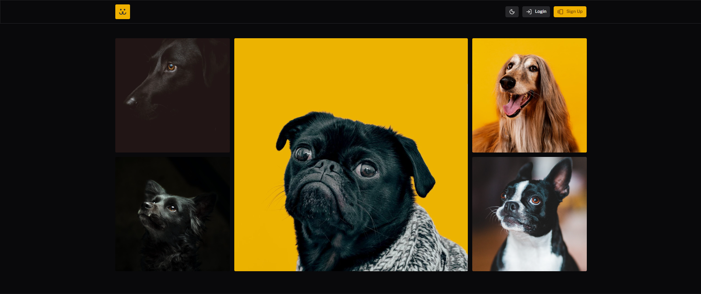

<p align="center">
  
</p>

# Dogs

Plataforma de compartilhamento de fotos de cachorros — feed infinito, postagem, perfil do usuário e dashboard de estatísticas de acessos por foto.

> **Terceira versão do projeto**, agora reconstruído com **TanStack Start** (SSR full-stack) e deploy no Netlify.

## Tecnologias

| Camada | Ferramentas |
|--------|-------------|
| Framework | [TanStack Start](https://tanstack.com/start) · React 19 · TypeScript |
| Roteamento | [TanStack Router](https://tanstack.com/router) (file-based) + [TanStack Query](https://tanstack.com/query) |
| UI | [Shadcn/ui](https://ui.shadcn.com) · Tailwind CSS v4 · Lucide Icons |
| Charts | Recharts |
| Forms | [TanStack Form](https://tanstack.com/form) · Zod |
| Build / Deploy | Vite 8 · Netlify |

## Como rodar

```bash
pnpm install
pnpm dev        # http://localhost:3000
```

## Build

```bash
pnpm build      # gera dist/client + dist/server
pnpm preview    # preview do build
```
